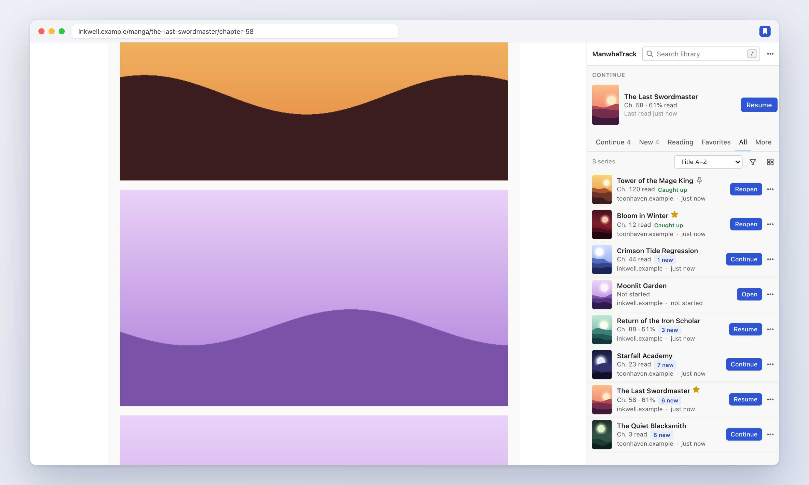
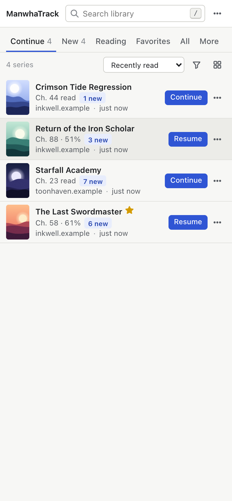
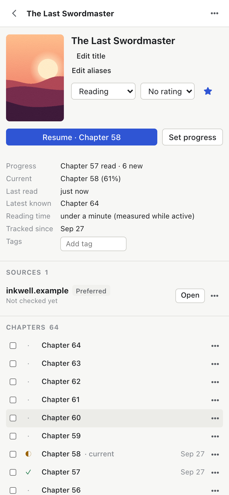
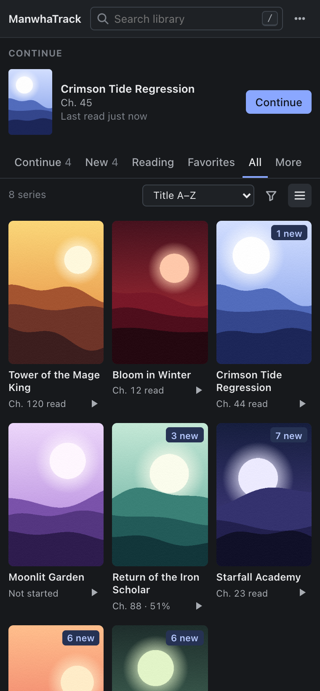
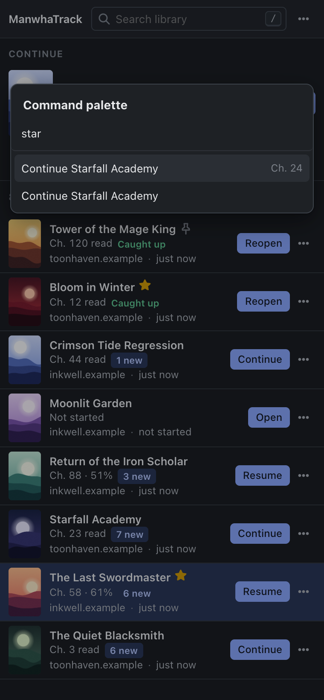
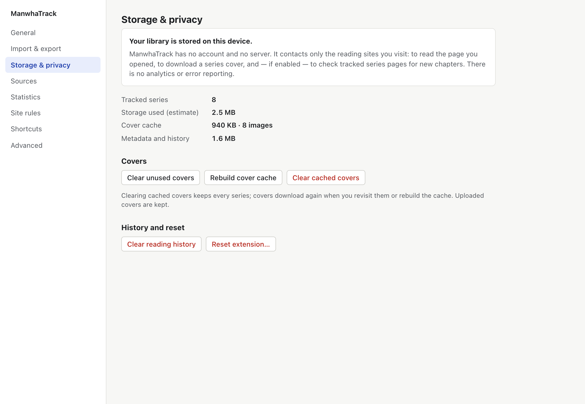
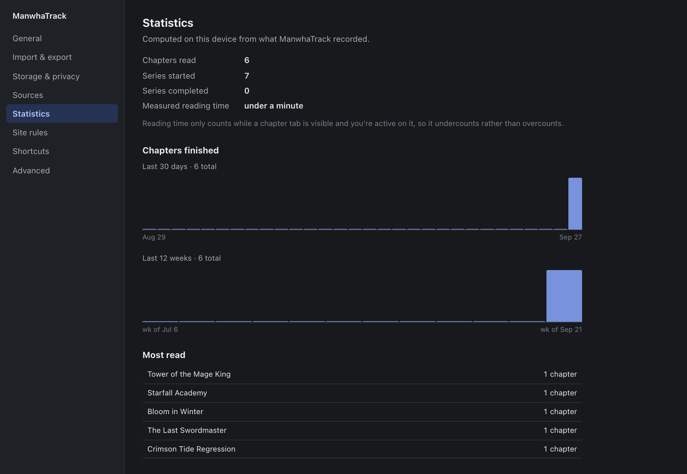
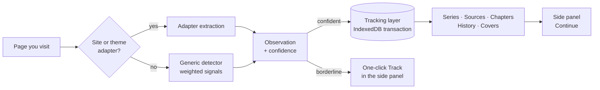

<div align="center">


# ManwhaTrack

**Open a manhwa. It remembers. Come back and continue in one click.**

A Chrome extension that tracks your manhwa, manga and webtoon reading automatically —<br>
series, chapters, progress and covers — and keeps every bit of it on your own device.

[](https://github.com/desenyon/ManwhaTrack/actions/workflows/ci.yml)
[](https://github.com/desenyon/ManwhaTrack/releases/latest)
[](LICENSE)


[**Download**](https://github.com/desenyon/ManwhaTrack/releases/latest) · [Features](#features) · [Supported sites](#supported-sites) · [Privacy](#privacy) · [Development](#development)

<br>



</div>

<br>

## Why

Reading across a handful of sites means remembering which chapter you reached, where you read it, and digging through history to get back. ManwhaTrack does that bookkeeping for you:

- **No adding.** Visit a series or open a chapter and it's in your library, cover included.
- **Honest progress.** Opening a chapter isn't finishing it. A chapter counts as read when you reach the end of the reader, or click the site's *Next* button.
- **One click back.** *Continue* takes you to the next chapter after the last one you finished — or back into the one you left half-way.
- **Yours alone.** No account, no server, no analytics. The library lives in your browser's local database and works offline.

## Features

<table>
<tr>
<td width="50%" valign="top">

### Library that stays out of the way
A dense side panel beside whatever you're reading. Continue, New, Reading, Favorites, All and more views; composable filters; sort remembered per view; list or grid; instant, typo-tolerant search.

</td>
<td width="50%" valign="top">

<picture>
  <source media="(prefers-color-scheme: dark)" srcset="docs/screenshots/library-dark.png">
  
</picture>

</td>
</tr>
<tr>
<td width="50%" valign="top">

<picture>
  <source media="(prefers-color-scheme: dark)" srcset="docs/screenshots/detail-dark.png">
  
</picture>

</td>
<td width="50%" valign="top">

### Every detail, editable
Chapter timeline with read / in-progress marks, "mark all up to here", per-series history, notes, tags, rating, status, aliases and covers you can refresh, pick or upload. **Your edits always win** — later detections never overwrite them.

</td>
</tr>
<tr>
<td width="50%" valign="top">

### New chapters, quietly
Optional update checks go straight to each site — a few per run, one per site, backing off when a site misbehaves. A subtle **3 new** beside the series, an optional badge, optional notifications.

</td>
<td width="50%" valign="top">



</td>
</tr>
</table>

**Also inside:** multiple sources per series with duplicate suggestions, merge and split · a reading queue with drag-and-drop · batch actions with Undo · a <kbd>⌘</kbd>/<kbd>Ctrl</kbd>+<kbd>K</kbd> command palette · `mt` search in the address bar · a Detection Inspector that shows exactly what was recognized and why · your own CSS-selector rules for unusual sites · reading statistics · light, dark and system themes · full keyboard control.

<p align="center">
  
  &nbsp;
  
</p>

<details>
<summary><b>Reading statistics</b></summary>
<br>

</details>

## Supported sites

ManwhaTrack recognizes pages in three layers, from most to least specific:

| | Covers | How |
| --- | --- | --- |
| **Site adapters** | webtoons.com (Originals & Canvas), Tapas, MangaDex, MANGA Plus | Purpose-built readers for each site, including paged readers ("page 3 / 18") |
| **Theme adapters** | Sites built on the Madara and MangaThemesia WordPress themes | Matched by page structure, whatever the domain |
| **Generic detector** | Everything else | Scores URL patterns, reader image stacks, breadcrumbs, next/previous links, chapter lists, structured data and titles |

Only confident detections are saved automatically; a borderline page shows a one-click **Track** button instead. If a site isn't recognized well, the Detection Inspector explains why and *Settings → Site rules* lets you point ManwhaTrack at the right elements.

> [!NOTE]
> The site adapters are exercised against the live sites by an opt-in test (`LIVE=1`), and against saved HTML fixtures in every CI run. Sites change their markup; if one breaks, please [open a detection issue](https://github.com/desenyon/ManwhaTrack/issues/new?template=detection.yml).

## Install

**From a release (recommended)**

1. Download `manwhatrack-<version>.zip` from the [latest release](https://github.com/desenyon/ManwhaTrack/releases/latest) and unzip it.
2. Open `chrome://extensions` and switch on **Developer mode**.
3. Click **Load unpacked** and choose the unzipped folder.
4. Pin ManwhaTrack from the puzzle-piece menu. Click it to open the side panel.

**From source**

```bash
git clone https://github.com/desenyon/ManwhaTrack.git && cd ManwhaTrack
```

```bash
npm install && npm run build
```

Then load the `dist/` folder as above. `npm run launch` opens a separate Chrome for Testing window with the extension already loaded and its own profile.

## Privacy

> **Your library is stored on this device. ManwhaTrack has no account and no server.**

ManwhaTrack talks only to the reading sites you use — to read the page you opened, to download a series cover once, and (if enabled) to check tracked series for new chapters. There are no analytics, no telemetry, no remote code and no error reporting. Incognito windows are ignored unless you turn that on. See [PRIVACY.md](PRIVACY.md) for details.

<details>
<summary><b>Permissions and why each is needed</b></summary>

<br>

| Permission | Used for |
| --- | --- |
| Access to `http` / `https` pages | Recognizing reading pages on any site; downloading covers; update checks |
| `storage`, `unlimitedStorage` | Settings and the local library |
| `sidePanel` | The main interface |
| `alarms` | Periodic update checks and maintenance |
| `contextMenus` | Page menu: track, mark read/unread, open series |
| `offscreen` | Parsing fetched series pages (service workers have no HTML parser) |
| `declarativeNetRequestWithHostAccess` | Sending the site's own Referer when downloading covers, so hotlink-protected images load |
| `notifications` *(optional)* | Requested only when you turn notifications on |

</details>

## Keyboard

| Key | Action | | Key | Action |
| --- | --- | --- | --- | --- |
| <kbd>/</kbd> | Search | | <kbd>f</kbd> | Favorite |
| <kbd>j</kbd> <kbd>k</kbd> / <kbd>↓</kbd> <kbd>↑</kbd> | Move through the list | | <kbd>r</kbd> / <kbd>Shift</kbd>+<kbd>r</kbd> | Mark read / unread |
| <kbd>Enter</kbd> | Continue the selected series | | <kbd>Esc</kbd> | Back / close |
| <kbd>⌘</kbd>/<kbd>Ctrl</kbd>+<kbd>K</kbd> | Command palette | | <kbd>?</kbd> | Show all shortcuts |

All of them can be changed in *Settings → Shortcuts*. In the address bar, type `mt` and a space to search your library.

## How it works



- **Content script** (framework-free, ~40 KB) detects the page, watches client-side navigation, and measures progress through the chapter's reader area — or page count on paged readers.
- **Service worker** validates everything it receives, writes each change in a single IndexedDB transaction, caches covers as small local images, and runs update checks. Nothing depends on the worker staying alive.
- **Side panel and settings** are React, reading the same local database directly.

## Development

```bash
npm install
```

```bash
npm run check
```

`check` runs the TypeScript compiler, the unit tests (detection fixtures, storage, migrations, backups, search) and a production build.

| Command | What it does |
| --- | --- |
| `npm run dev` | Rebuild on change (reload the extension to pick it up) |
| `npm run test:e2e` | Build, then run the Chromium end-to-end suite |
| `LIVE=1 npm run test:e2e -- live-sites` | Smoke-test against the real supported sites |
| `SCREENSHOT_DIR=docs/screenshots npm run test:e2e -- screenshots` | Regenerate the README screenshots |
| `npm run package` | Build and zip `dist/` for release |
| `npm run launch` | Open Chrome for Testing with the extension loaded |

The end-to-end suite loads the built extension in Chromium and checks the core promise: discover a series, read Chapter 31, click *Next*, restart the browser, press *Continue*, land on Chapter 32 — plus update checks, offline use and survival of service-worker termination.

<details>
<summary><b>Project layout</b></summary>

```
src/
  background/   service worker: messages, update checks, covers, menus, omnibox, badge
  content/      content script: detection runner, SPA observer, reading progress, undo toast
  detection/    site & theme adapters, generic detector, chapter/title/URL normalization
  storage/      IndexedDB wrapper, migrations, repositories, tracking layer, backup
  sidepanel/    the side panel (library, detail, inspector, history, queue)
  options/      settings, import/export, privacy, site rules, sources, statistics
  offscreen/    HTML parsing for update checks
  shared/       types, message contracts, search, views, stats, formatting
tests/          unit tests, HTML fixtures, Playwright end-to-end tests
```

</details>

Contributions are welcome — [CONTRIBUTING.md](CONTRIBUTING.md) explains the ground rules, and [AGENTS.md](AGENTS.md) holds the full product specification this codebase follows.

## License

[MIT](LICENSE) © 2026 Naitik Gupta
