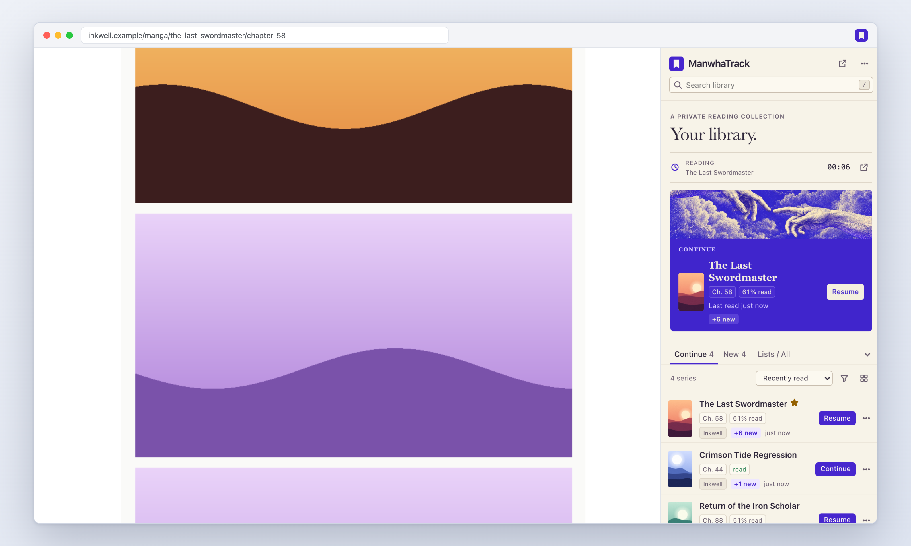
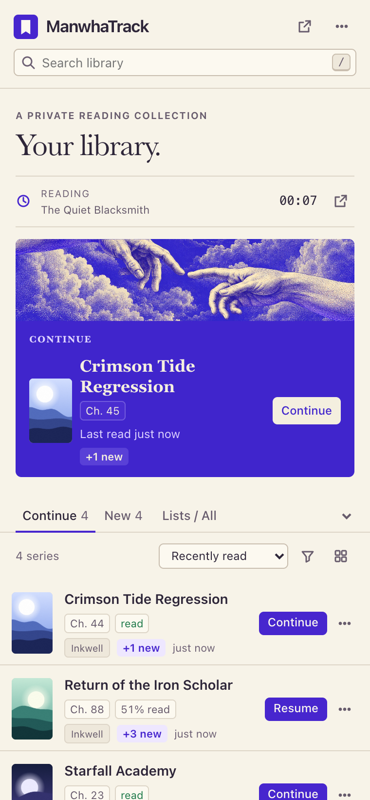
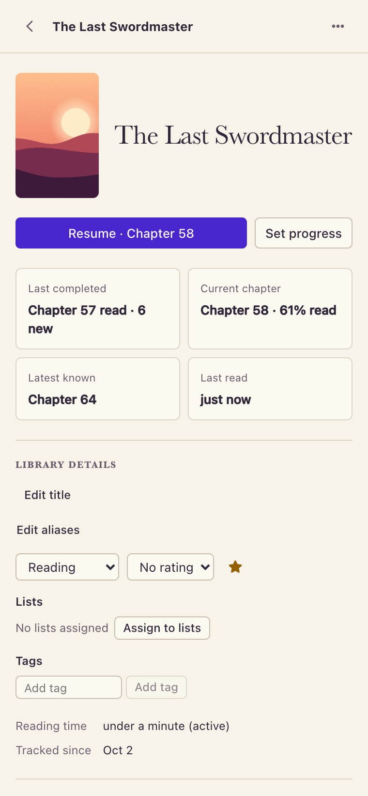
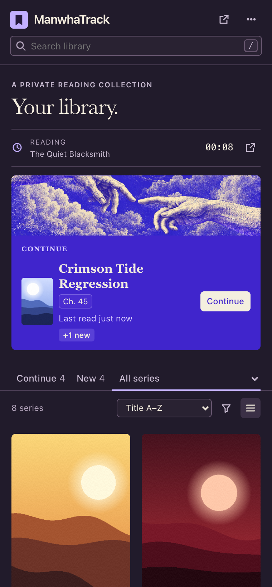
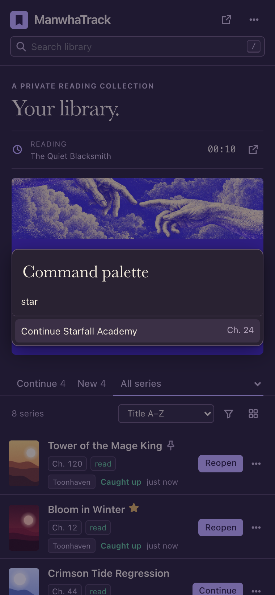
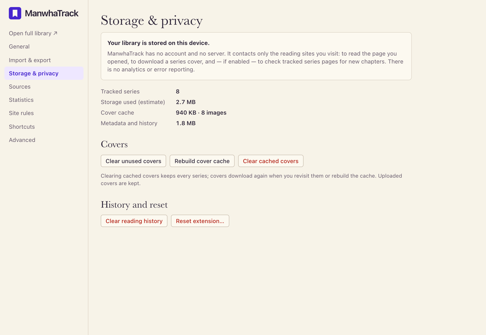
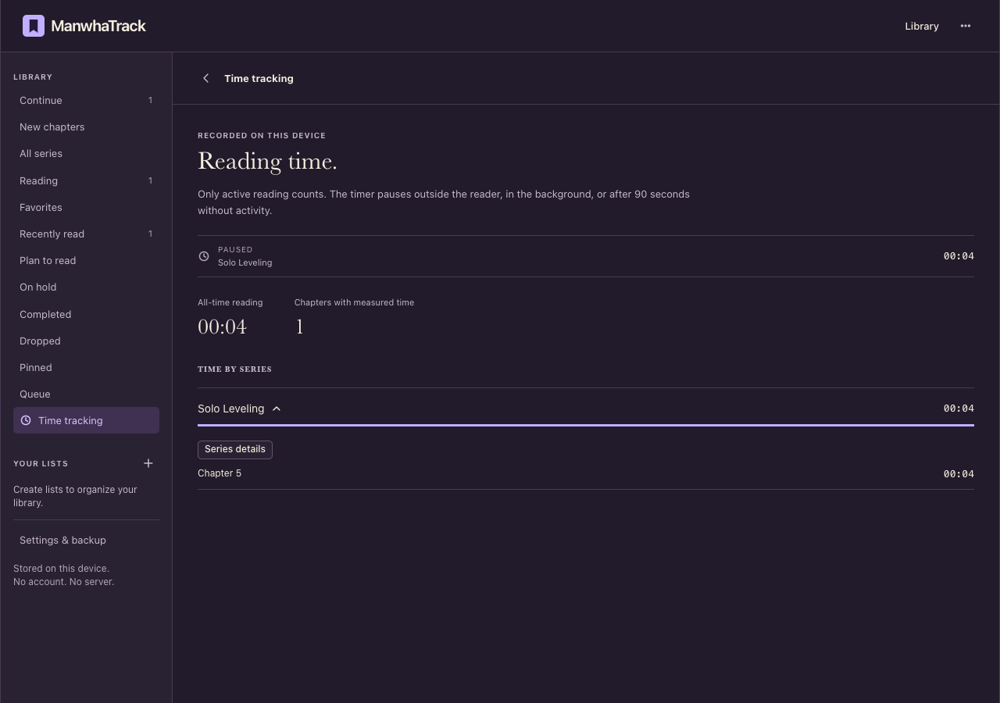
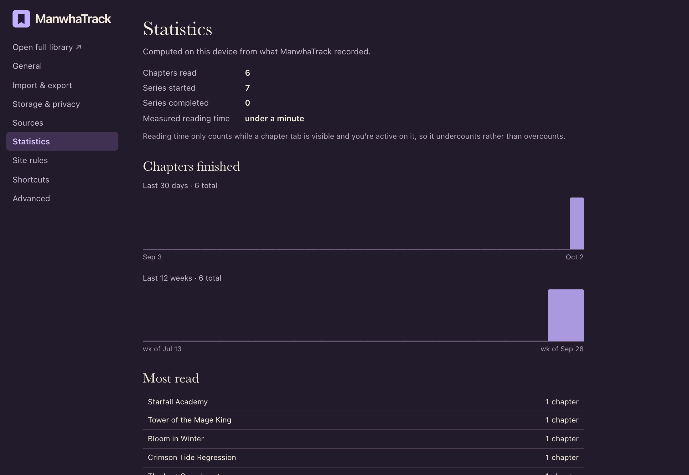
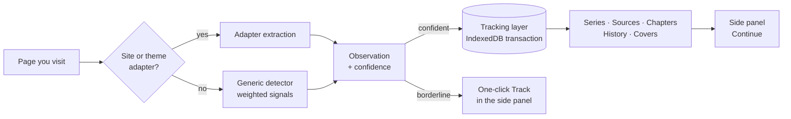

<div align="center">


# ManwhaTrack

**Open a manhwa. It remembers. Come back and continue in one click.**

A Chrome extension that tracks your manhwa, manga, webtoon and web novel reading automatically —<br>
series, chapters, progress and covers — and keeps every bit of it on your own device.

[](https://github.com/desenyon/ManwhaTrack/actions/workflows/ci.yml)
[](https://github.com/desenyon/ManwhaTrack/releases/latest)
[](LICENSE)


[**Download**](https://github.com/desenyon/ManwhaTrack/releases/latest) · [Features](#features) · [Supported sites](#supported-sites) · [Privacy](#privacy) · [Development](#development)

<br>



</div>

<br>

## Why

Reading across a handful of sites means remembering which chapter you reached, where you read it, and digging through history to get back. ManwhaTrack does that bookkeeping for you:

- **No adding.** Visit a series or open a chapter and it's in your library, cover included.
- **Honest progress.** Opening a chapter isn't finishing it. A chapter counts as read when you reach the end of the reader, or click the site's *Next* button.
- **One click back.** *Continue* takes you to the next chapter after the last one you finished — or back into the one you left half-way.
- **Yours alone.** No account, no server, no tracking telemetry. The library lives in your browser's local database and works offline.

## Features

<table>
<tr>
<td width="50%" valign="top">

### Library that stays out of the way
A dense side panel beside whatever you're reading. Continue and New stay visible; the list chooser holds your own collections and other library views. Open the full library with the expand icon beside the header menu. Both views share the same local data, filters, sorting and search. The sidebar starts as a compact list; the expanded library starts with larger cover cards. Each remembers its own layout. Add series directly from a personal list's page. Settings control card size, timer visibility, quiet outer scenery and scrollbar visuals.

</td>
<td width="50%" valign="top">

<picture>
  <source media="(prefers-color-scheme: dark)" srcset="docs/implementation/motion-time-screenshots/library-dark.png">
  
</picture>

</td>
</tr>
<tr>
<td width="50%" valign="top">

<picture>
  <source media="(prefers-color-scheme: dark)" srcset="docs/implementation/motion-time-screenshots/detail-dark.png">
  
</picture>

</td>
<td width="50%" valign="top">

### Every detail, editable
Chapter timeline with read / in-progress marks, "mark all up to here", per-series history, notes, tags, rating, status, aliases and covers you can refresh, pick or upload. **Your edits always win** — later detections never overwrite them.

</td>
</tr>
<tr>
<td width="50%" valign="top">

### New chapters, quietly
Optional update checks go straight to each site — a few per run, one per site, backing off when a site misbehaves. A subtle **3 new** beside the series, an optional badge, optional notifications.

</td>
<td width="50%" valign="top">



</td>
</tr>
</table>

**Also inside:** persistent custom lists with individual/bulk assignment · multiple sources per series with duplicate suggestions, merge and split · a reading queue with drag-and-drop · batch actions with Undo · a <kbd>⌘</kbd>/<kbd>Ctrl</kbd>+<kbd>K</kbd> command palette · `mt` search in the address bar · a Detection Inspector that shows exactly what was recognized and why · your own CSS-selector rules for unusual sites · reading statistics · light, dark and system themes · full keyboard control.

<p align="center">
  
  &nbsp;
  
</p>

<details>
<summary><b>Reading time</b></summary>
<br>

</details>

<details>
<summary><b>Reading statistics</b></summary>
<br>

</details>

## Resume and organize

- **Resume** opens an unfinished chapter in a separate browser window at the saved viewport, anchored to the reader image when possible. Scrolling backward saves that earlier place without reducing furthest-read progress. Positions stay local and are included in JSON backups. Ordinary chapter visits do not automatically scroll.
- Scroll readers support position restoration, including delayed image layout. Paged/canvas readers still resume the chapter; automatic page navigation is not supported. Older records gain a saved viewport on their next visit, rather than guessing one from percentage read.
- Choose **Lists / All → Create / manage lists** to create, rename or delete lists and choose their series. Use **Assign to lists** in a series menu, details, or a multiple selection. A series can belong to several lists; deleting a list preserves its reading records.
- Add arbitrary tags in series details, or use **Add tag** for a multiple selection. Tags are searchable and available in Filters. **New** shows known unread chapters for series you have actively read with Reading status; Continue also displays new-chapter counts.
- Click **Expand library** beside the header menu for the full local library tab, with a navigation rail at wide widths. Resume opens a separate reading window; other Continue destinations open a reading tab so the library remains available. Modifier or middle-click opens a new tab.
- Inline chapter and reading facts keep rows readable; a small cover label distinguishes novels from manhwa. Source labels retain the original hostname in their tooltip. Expanded details separate metadata, sources and the chapter timeline into columns.
- The compact timer beside **Your Library** measures active reading and pauses when the chapter loses focus, the reader leaves view, or you are idle for 90 seconds. Open **Time tracking** beside it or from the expanded navigation rail for locally saved totals by series and chapter. Closing the browser preserves recorded totals; the live session clock starts fresh.
- Bundled engraved artwork has independent hand, cloud, bridge and water movement. It pauses when hidden or off-screen. **Play / Pause** in the footer controls motion; **Settings → General → Artwork motion** also offers System, On and Off. System respects reduced motion; explicit Play enables it. The bridge height responds to window height and the space occupied by the visible library.

## Local reading analytics

Open **Analytics** from the expanded library navigation or the sidebar menu. **Reading analytics** in series details opens a focused view of that title. Activity heatmaps, reading-time graphs, sessions, time of day, backlog snapshots, pace, retention, genre/source breakdowns and historical milestones are calculated entirely on your device.

- Dated active time is recorded from version 1.2.0 onward. Earlier chapter totals remain intact but cannot be assigned invented dates, hours or sessions.
- Activity counts automatic completions, rather than bulk manual progress corrections. Sessions group measured reading with gaps of no more than 15 minutes. Hourly activity uses minute-level measurements.
- Backlog means known new chapters waiting; its trend builds from dated local snapshots. Catch-up estimates use measured chapter times and recent completion pace.
- Update timing means **first observed after an established catalog**, not the publisher's release date. Initial catalogs do not count as newly released chapters.
- Retention excludes active series that have not yet accumulated enough observed chapters. Genre analysis requires detected or manually entered genres; arbitrary tags are not treated as genres.
- Backups include dated measurements, format labels, genres and backlog snapshots. Clearing reading history also clears dated analytics, while retaining the library, chapter progress and lifetime chapter time.

Web novels use the same local progress, Resume, lists, tags, cover caching and backup system. Generic detection recognizes substantial paragraph readers; platform templates avoid mistaking opaque chapter IDs for chapter numbers. Protected, unrendered or unusual readers may need local site rules or manual correction. Template fixtures and local browser flows are tested; universal compatibility with every novel site is not claimed.

## Supported sites

ManwhaTrack recognizes pages in three layers, from most to least specific:

| | Covers | How |
| --- | --- | --- |
| **Site adapters** | webtoons.com (Originals & Canvas), Tapas, MangaDex, MANGA Plus, Royal Road and Webnovel reading templates | Purpose-built readers for each site, including paged readers ("page 3 / 18") |
| **Theme adapters** | Sites built on the Madara and MangaThemesia WordPress themes | Matched by page structure, whatever the domain |
| **Generic detector** | Everything else | Scores URL patterns, reader image stacks or substantial prose, breadcrumbs, next/previous links, chapter lists, structured data and titles |

Only confident detections are saved automatically; a borderline page shows a one-click **Track** button instead. If a site isn't recognized well, the Detection Inspector explains why and *Settings → Site rules* lets you point ManwhaTrack at the right elements.

> [!NOTE]
> The site adapters are exercised against the live sites by an opt-in test (`LIVE=1`), and against saved HTML fixtures in every CI run. Sites change their markup; if one breaks, please [open a detection issue](https://github.com/desenyon/ManwhaTrack/issues/new?template=detection.yml).

## Install

**From a release (recommended)**

1. Download `manwhatrack-<version>.zip` from the [latest release](https://github.com/desenyon/ManwhaTrack/releases/latest) and unzip it.
2. Open `chrome://extensions` and switch on **Developer mode**.
3. Click **Load unpacked** and choose the unzipped folder.
4. Pin ManwhaTrack from the puzzle-piece menu. Click it to open the side panel.

**From source**

```bash
git clone https://github.com/desenyon/ManwhaTrack.git && cd ManwhaTrack
```

```bash
npm install && npm run build
```

Then load the `dist/` folder as above. `npm run launch` opens a separate Chrome for Testing window with the extension already loaded and its own profile.

## Privacy

> **Your library is stored on this device. ManwhaTrack has no account and no server.**

ManwhaTrack talks only to the reading sites you use — to read the page you opened, to download a series cover once, and (if enabled) to check tracked series for new chapters. Reading analytics are computed locally. There is no telemetry, remote code or external error reporting. Incognito windows are ignored unless you turn that on. See [PRIVACY.md](PRIVACY.md) for details.

<details>
<summary><b>Permissions and why each is needed</b></summary>

<br>

| Permission | Used for |
| --- | --- |
| Access to `http` / `https` pages | Recognizing reading pages on any site; downloading covers; update checks |
| `storage`, `unlimitedStorage` | Settings and the local library |
| `sidePanel` | The main interface |
| `alarms` | Periodic update checks and maintenance |
| `contextMenus` | Page menu: track, mark read/unread, open series |
| `offscreen` | Parsing fetched series pages (service workers have no HTML parser) |
| `declarativeNetRequestWithHostAccess` | Sending the site's own Referer when downloading covers, so hotlink-protected images load |
| `notifications` *(optional)* | Requested only when you turn notifications on |

</details>

## Keyboard

| Key | Action | | Key | Action |
| --- | --- | --- | --- | --- |
| <kbd>/</kbd> | Search | | <kbd>f</kbd> | Favorite |
| <kbd>j</kbd> <kbd>k</kbd> / <kbd>↓</kbd> <kbd>↑</kbd> | Move through the list | | <kbd>r</kbd> / <kbd>Shift</kbd>+<kbd>r</kbd> | Mark read / unread |
| <kbd>Enter</kbd> | Continue the selected series | | <kbd>Esc</kbd> | Back / close |
| <kbd>⌘</kbd>/<kbd>Ctrl</kbd>+<kbd>K</kbd> | Command palette | | <kbd>?</kbd> | Show all shortcuts |

All of them can be changed in *Settings → Shortcuts*. In the address bar, type `mt` and a space to search your library.

## How it works



- **Content script** (framework-free, ~50 KB) detects the page, watches client-side navigation, and measures progress through the chapter's reader area — or page count on paged readers.
- **Service worker** validates everything it receives, writes each change in a single IndexedDB transaction, caches covers as small local images, and runs update checks. Nothing depends on the worker staying alive.
- **Side panel, full library and settings** are React, reading the same local database directly.

## Development

```bash
npm install
```

```bash
npm run check
```

`check` runs the TypeScript compiler, the unit tests (detection fixtures, storage, migrations, backups, search) and a production build.

| Command | What it does |
| --- | --- |
| `npm run dev` | Rebuild on change (reload the extension to pick it up) |
| `npm run test:e2e` | Build, then run the Chromium end-to-end suite |
| `LIVE=1 npm run test:e2e -- live-sites` | Smoke-test against the real supported sites |
| `SCREENSHOT_DIR=docs/implementation/collections-resume-screenshots npm run test:e2e -- screenshots` | Regenerate the README screenshots |
| `npm run package` | Build and zip `dist/` for release |
| `npm run launch` | Open Chrome for Testing with the extension loaded |

The end-to-end suite loads the built extension in Chromium and checks the core promise: discover a series, read Chapter 31, click *Next*, restart the browser, press *Continue*, land on Chapter 32 — plus saved viewport Resume, persistent lists/tags, backup, expanded-library interactions, update checks, offline use and survival of service-worker termination.

The latest [workspace flow verification](docs/implementation/workspace-flow-verification.md) covers direct list membership, preferences after restart, scrolling, expanded navigation and outer scenery. [Library refinement verification](docs/implementation/library-refinement-verification.md) covers Nano Machine chapter repair, separate-window Resume, expanded cards and details, layout persistence and active-time checks. Earlier [motion and time verification](docs/implementation/motion-time-verification.md) records the animation and timer acceptance checks.

<details>
<summary><b>Project layout</b></summary>

```
src/
  background/   service worker: messages, update checks, covers, menus, omnibox, badge
  content/      content script: detection runner, SPA observer, reading progress, undo toast
  detection/    site & theme adapters, generic detector, chapter/title/URL normalization
  storage/      IndexedDB wrapper, migrations, repositories, tracking layer, backup
  sidepanel/    the side panel (library, detail, inspector, history, queue)
  options/      settings, import/export, privacy, site rules, sources, statistics
  offscreen/    HTML parsing for update checks
  shared/       types, message contracts, search, views, stats, formatting
tests/          unit tests, HTML fixtures, Playwright end-to-end tests
```

</details>

Contributions are welcome — [CONTRIBUTING.md](CONTRIBUTING.md) explains the ground rules, and [AGENTS.md](AGENTS.md) holds the full product specification this codebase follows.

## License

[MIT](LICENSE) © 2026 Naitik Gupta
